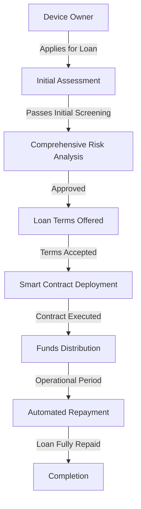

# DePIN Lending System

DOB Protocol's lending system provides undercollateralized financing for DePIN device owners, leveraging tokenized future revenues as a novel form of collateral. This enables rapid scaling of decentralized infrastructure while reducing capital barriers.

## Overview

Traditional DeFi lending requires overcollateralization (often 150-200% of the loan value), making it inefficient for infrastructure financing. DOB Protocol's lending system enables undercollateralized loans (as low as 50% collateral) by using:

1. Tokenized future revenue streams as primary collateral
2. AI-powered risk assessment and monitoring
3. Dynamic repayment mechanisms tied to actual revenue generation
4. Multi-layered insurance protections

## How It Works

### Eligibility Requirements

To qualify for undercollateralized lending, DePIN devices must:

- Have at least 90 days of operational history
- Consistently generate verifiable revenue
- Have tokenized a portion of their revenue through DOB Protocol
- Pass a comprehensive risk assessment

### Loan Types

DOB Protocol supports multiple lending models:

#### 1. Revenue-Based Loans

- **Collateral**: 50-80% of loan value in tokenized revenue rights
- **Repayment**: Automatic deductions from ongoing device revenue
- **Term**: Flexible until fully repaid
- **Use Case**: Scaling existing operations with proven revenue models

#### 2. Growth Financing

- **Collateral**: 70-90% of loan value in tokenized revenue + device ownership
- **Repayment**: Fixed schedule with revenue-based adjustments
- **Term**: 6-24 months
- **Use Case**: Expanding to new geographic regions or device types

#### 3. Fleet Financing

- **Collateral**: 60-80% across portfolio of devices (cross-collateralized)
- **Repayment**: Blended revenue sharing across all financed devices
- **Term**: 12-36 months
- **Use Case**: Deployment of multiple devices simultaneously

## Risk Assessment Framework

The lending system's AI-powered risk assessment evaluates multiple factors:

### Device Performance Metrics

- **Historical Revenue**: Consistency and trends in revenue generation
- **Operational Uptime**: Reliability of device operation
- **Maintenance History**: Regular maintenance and upgrades
- **Geographic Distribution**: Location risk diversification

### Market Factors

- **Industry Trends**: Growth trajectory of specific DePIN segments
- **Token Liquidity**: Market depth for tokenized revenue streams
- **Competitive Landscape**: Emerging technologies or competitors
- **Regulatory Environment**: Jurisdiction-specific legal considerations

### Operator Profile

- **Operational History**: Track record of the device operator
- **Technical Expertise**: Capability to maintain and optimize devices
- **Financial Health**: Overall financial stability of the operator
- **Community Reputation**: Standing within the DePIN ecosystem

## Lending Process

### Application and Assessment

1. Device owner applies through the DOB Portal
2. AI system performs initial eligibility screening
3. Comprehensive risk assessment is conducted
4. Loan terms are generated based on risk profile

### Loan Execution

1. Borrower reviews and accepts loan terms
2. Smart contracts are deployed for loan management
3. Collateral is secured in escrow contracts
4. Funds are distributed to the borrower

### Repayment and Monitoring

1. Automatic deductions from device revenue for repayment
2. Continuous monitoring of device performance
3. Periodic risk reassessment
4. Dynamic adjustment of terms if needed

## Insurance and Risk Mitigation

DOB Protocol employs multiple layers of protection:

### Collateral Management

- **Dynamic LTV Ratios**: Loan-to-value ratios adjusted based on risk
- **Collateral Diversification**: Multiple revenue streams and device types
- **Partial Liquidation**: Graduated liquidation mechanisms to prevent cascading failures

### Insurance Pools

- **Protocol-Owned Insurance**: Funded from protocol fees
- **Optional Borrower Coverage**: Additional protection for premium reduction
- **Lender Protection**: Coverage for default scenarios

### Early Warning Systems

- **Performance Alerts**: Notifications when device metrics decline
- **Revenue Shortfall Detection**: Early identification of repayment issues
- **Intervention Protocols**: Step-by-step procedures for addressing problems

## Default Management

In case of loan default, DOB Protocol follows a structured process:

1. **Grace Period**: Temporary pause with working capital infusion
2. **Restructuring**: Adjusting terms to improve viability
3. **Operator Replacement**: Transferring device management if necessary
4. **Collateral Liquidation**: Gradual, market-sensitive liquidation
5. **Insurance Claims**: Processing claims for residual balances

## Loan Terms

### Interest Rates

Interest rates are dynamically calculated based on risk assessment:

- **Base Rate**: Tied to market benchmarks
- **Risk Premium**: Calculated from risk score
- **Performance Adjustment**: Decreases with positive payment history
- **Range**: Typically 5-15% APR (significantly lower than unsecured financing)

### Loan-to-Value (LTV) Ratios

Maximum LTV varies by risk category:

- **Low Risk**: Up to 50% undercollateralized (50% LTV)
- **Moderate Risk**: Up to 30% undercollateralized (70% LTV)
- **Higher Risk**: Up to 10% undercollateralized (90% LTV)

### Term Lengths

Available terms range from:

- **Short-term**: 3-6 months
- **Medium-term**: 6-18 months
- **Long-term**: 18-36 months

## Lender Participation

Capital providers can participate in the lending ecosystem:

### Lending Pools

- **Open Pools**: General lending pools diversified across device types
- **Specialized Pools**: Focused on specific device categories or risk profiles
- **Managed Pools**: Professionally managed investment vehicles

### Direct Lending

- **Loan Origination**: Directly funding specific device loans
- **Secondary Market**: Purchasing existing loans
- **Customized Terms**: Negotiating specific parameters for large loans

## Analytics and Reporting

The DOB Portal provides comprehensive lending analytics:

- **Portfolio Overview**: Performance metrics across all loans
- **Risk Visualization**: Heat maps and risk distribution analysis
- **Repayment Projections**: Expected payment schedules
- **Stress Testing**: Scenario analysis for market downturns

## Getting Started

To access DePIN financing through DOB Protocol:

1. Register your devices on the DOB Protocol platform
2. Tokenize a portion of your device revenue
3. Build operational history (minimum 90 days)
4. Apply for financing through the DOB Portal
5. Receive AI-generated loan terms
6. Accept terms and receive funding

For detailed information on the application process, see the [Loan Application Guide](/guides/loan-application).
