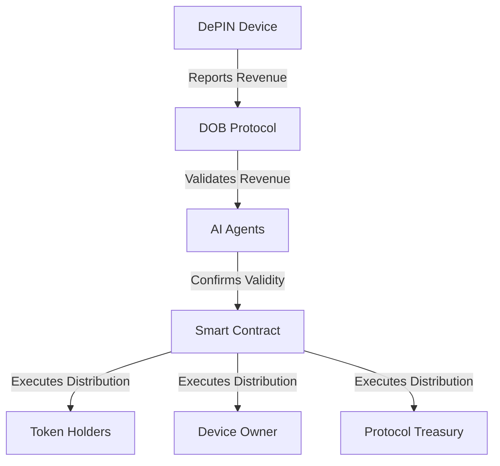

# Revenue Distribution

DOB Protocol's revenue distribution system ensures fair, transparent, and automated distribution of earnings from DePIN devices to stakeholders. This component is critical for building trust in the tokenization of device revenues.

## Overview

The revenue distribution system performs several key functions:

- **Revenue Collection**: Aggregates revenue from various sources and devices
- **Validation**: Verifies the accuracy of reported revenues
- **Distribution**: Allocates funds to stakeholders based on ownership percentages
- **Reporting**: Provides transparent records of all distributions
- **Optimization**: Minimizes gas costs and maximizes efficiency

## How It Works

### Revenue Collection

DePIN devices generate revenue through various mechanisms depending on the device type:

- **Compute Nodes**: Payment for processing tasks
- **Energy Nodes**: Payment for energy production
- **Network Nodes**: Payment for bandwidth or connectivity
- **Data Nodes**: Payment for data storage or access

The DOB Agent installed on each device securely reports revenue generation to the protocol.

### Validation Process

AI agents validate reported revenues through:

1. **Historical Analysis**: Comparing current revenues with historical patterns
2. **Cross-Verification**: Checking revenue reports against blockchain records
3. **Anomaly Detection**: Identifying suspicious patterns in revenue reporting
4. **Consensus Mechanisms**: Requiring multiple validations for large revenues

### Distribution Mechanism

Once revenues are validated, the distribution occurs automatically:

### Distribution Formula

The standard revenue distribution formula is:

- **Token Holders**: 70-85% (based on ownership percentage)
- **Device Owner**: 10-25% (maintenance and operation fee)
- **Protocol Treasury**: 5% (platform fee)

These percentages are adjustable based on device type and specific tokenization terms.

## Features

### Automated Payouts

Revenue distribution occurs automatically based on predetermined intervals:

- **Daily**: For high-volume devices
- **Weekly**: Standard distribution schedule
- **Monthly**: For low-volume devices or when gas optimization is critical

### Multi-Token Support

The system supports distributions in multiple tokens:

- Native blockchain tokens (ETH, MATIC, etc.)
- Stablecoins (USDC, DAI, etc.)
- Protocol-specific tokens

### Gas Optimization

Several techniques minimize gas costs:

- Batched transactions for multiple recipients
- Layer 2 distributions when possible
- Dynamic timing based on network conditions

## Implementation Guide

To integrate with the revenue distribution system:

1. Configure the revenue reporting interval in your device configuration
2. Set up your distribution preferences in the DOB Portal
3. Define stakeholder addresses and percentages
4. Enable automated distribution or manual approval

## Advanced Configuration

For advanced users, the distribution system offers:

- **Custom Distribution Rules**: Set specific percentages for different stakeholders
- **Conditional Distributions**: Only distribute when certain conditions are met
- **Tax Withholding**: Automatically withhold a percentage for tax purposes
- **Revenue Reinvestment**: Automatically reinvest a portion of revenues

## Monitoring and Reporting

The DOB Portal provides real-time monitoring of revenue distribution:

- **Distribution History**: Records of all past distributions
- **Pending Distributions**: Upcoming scheduled distributions
- **Revenue Analytics**: Trends and patterns in revenue generation
- **Performance Metrics**: Efficiency and reliability of the distribution process

For more information on leveraging revenue data, see the [Analytics Guide](/guides/analytics).
