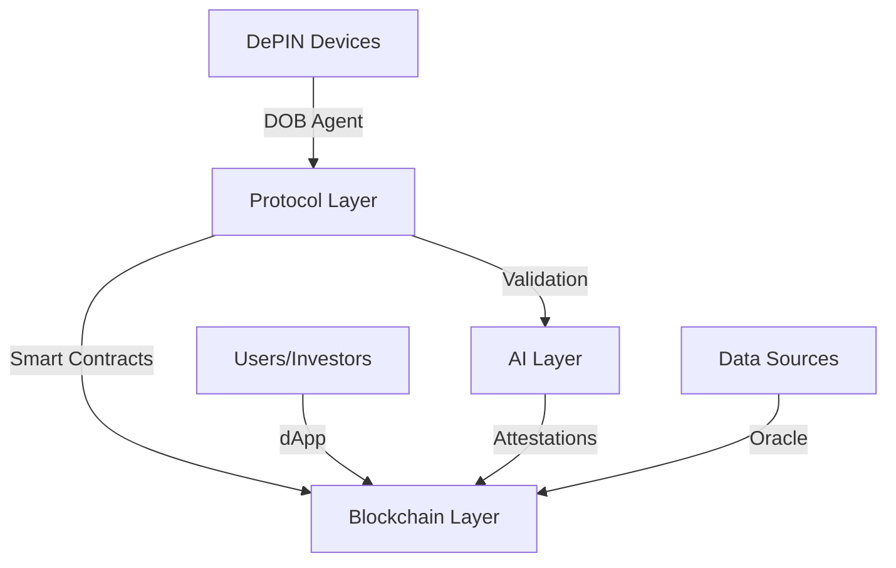
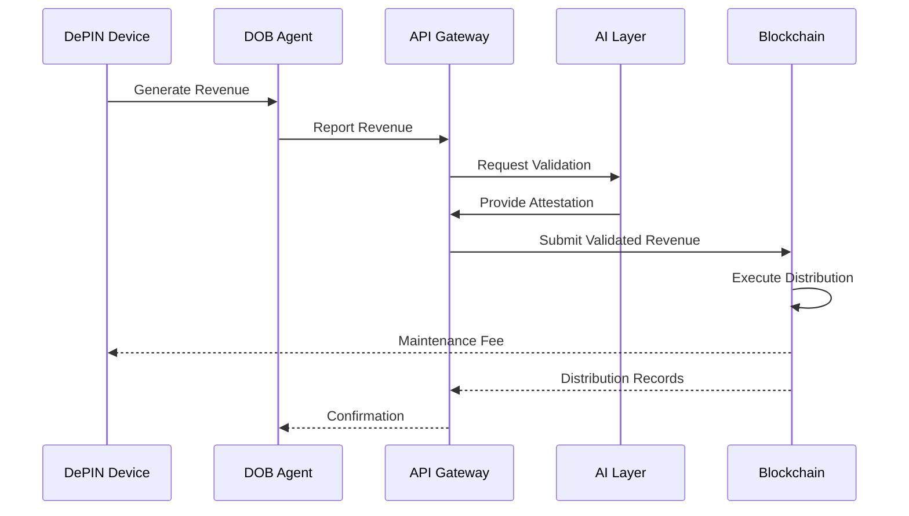

# DOB Protocol Architecture

This document provides an overview of the DOB Protocol architecture, explaining how different components interact to enable the tokenization and management of DePIN device revenues.

## System Overview

DOB Protocol consists of multiple integrated layers designed to form a comprehensive platform for DePIN financing:

## Core Components

### Device Layer

The Device Layer consists of all DePIN devices integrated with DOB Protocol:

- **DOB Agent**: Software installed on devices to report metrics and revenue
- **Attestation Modules**: Hardware or software components that verify device operation
- **Revenue Collection**: Mechanisms for receiving and accounting for device revenue

### Protocol Layer

The Protocol Layer manages the core business logic of DOB:

- **Authentication Service**: Manages device and user authentication
- **API Gateway**: Provides REST and GraphQL interfaces for interacting with the protocol
- **Metrics Processor**: Collects and processes device performance metrics
- **Revenue Manager**: Tracks revenue generation and distribution
- **Notification Service**: Alerts stakeholders of important events

### AI Layer

The AI Layer provides intelligence and automation:

- **Validation Engine**: Verifies the authenticity of reported revenues
- **Risk Assessment**: Analyzes device performance and financial risk
- **Forecasting**: Predicts future revenue based on historical performance
- **Anomaly Detection**: Identifies unusual patterns that may indicate issues
- **Optimization**: Recommends improvements for device operation and revenue

### Blockchain Layer

The Blockchain Layer handles all on-chain operations:

- **Smart Contracts**: Manage tokenization, revenue distribution, and governance
- **Token Standards**: Implementations of various token standards (ERC-20, ERC-1155, etc.)
- **State Management**: Maintains the on-chain state of all tokenized devices
- **Security Modules**: Protect against various attack vectors
- **Multi-chain Bridge**: Enables cross-chain functionality

### User Interface Layer

The User Interface Layer provides access points for users:

- **DOB Portal**: Web-based dashboard for device owners and investors
- **Mobile App**: On-the-go access to key functionality
- **Developer SDK**: Tools for third-party integration
- **Admin Interface**: Governance and protocol management tools

## Data Flow

The following diagram illustrates the data flow through the DOB Protocol system:

## Scalability Design

DOB Protocol is designed to scale to support millions of devices:

- **Horizontal Scaling**: All services can be horizontally scaled
- **Microservices Architecture**: Modular design allows independent scaling
- **Sharding**: Data is sharded across multiple databases
- **Load Balancing**: Requests are balanced across service instances
- **Caching Layer**: Reduces database load for frequent queries

## Security Architecture

Security is a core concern in the DOB Protocol design:

- **Device Authentication**: Secure device identity and authentication
- **Encryption**: All sensitive data is encrypted both in transit and at rest
- **Access Control**: Granular permission system for all operations
- **Intrusion Detection**: Systems to detect and prevent unauthorized access
- **Audit Logging**: Comprehensive logging of all system activities
- **Secure Enclaves**: Trusted Execution Environments for sensitive operations

## Deployment Model

DOB Protocol supports multiple deployment models:

- **Cloud-Native**: Primary deployment model using Kubernetes
- **Hybrid**: Critical components can be deployed on-premises
- **Multi-Region**: Distributed deployment across multiple regions
- **High Availability**: Redundant components ensure no single point of failure

## Technology Stack

DOB Protocol is built on modern, robust technologies:

- **Backend**: Rust, Go, Node.js
- **Smart Contracts**: Solidity, Move
- **Databases**: PostgreSQL, Redis, TimescaleDB
- **AI/ML**: TensorFlow, PyTorch
- **Infrastructure**: Kubernetes, Docker, Terraform
- **Blockchain**: Multi-chain support (Ethereum, Solana, and others)
- **Frontend**: React, Vue.js

## Integration Points

DOB Protocol offers several integration points:

- **REST API**: Primary integration method for most applications
- **GraphQL API**: Alternative API for complex data requirements
- **Webhooks**: Event-driven integration for real-time updates
- **SDK**: Libraries for various programming languages
- **Smart Contract Events**: On-chain integration points

## Future Architecture

The DOB Protocol architecture roadmap includes:

- **Layer 2 Integration**: Support for scaling solutions like Optimism and zkSync
- **ZK Proofs**: Zero-knowledge proofs for enhanced privacy
- **Decentralized Identity**: Integration with DID standards
- **Fully Decentralized Governance**: Transitioning to a DAO model
- **Cross-Chain Liquidity**: Seamless movement of tokens across blockchains
